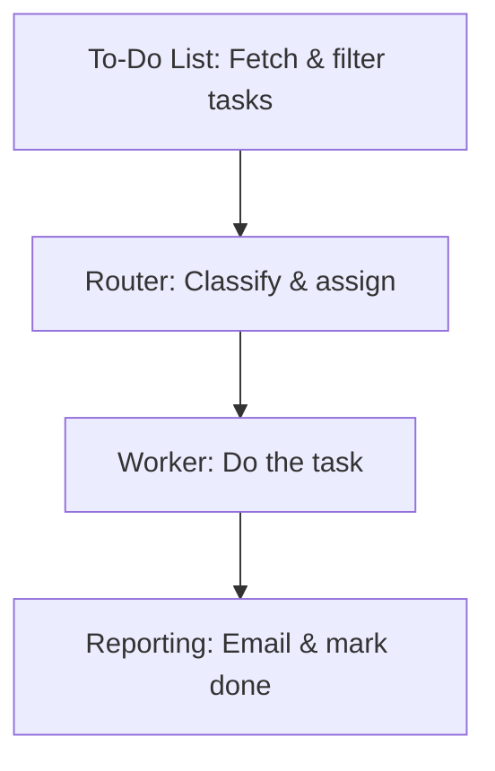

# GAS-TaskAutomation: Main Solution Blocks

A simplified Mermaid diagram of the main solution blocks:

If the diagram does not render, ensure you have a Mermaid-enabled Markdown preview extension in VS Code or use an online Mermaid live editor.